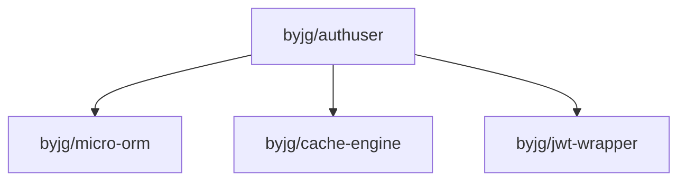

# Installation

## Requirements

- PHP 8.1 or higher
- Composer

## Install via Composer

Install the library using Composer:

```bash
composer require byjg/authuser
```

## Dependencies

The library depends on the following packages:

- `byjg/micro-orm` - For database operations
- `byjg/cache-engine` - For session management
- `byjg/jwt-wrapper` - For JWT token support

These dependencies are automatically installed by Composer.

:::info Dependency Graph

:::

## Running Tests

Because this project uses PHP Session, you need to run the unit tests with the `--stderr` flag:

```bash
./vendor/bin/phpunit --stderr
```

## Next Steps

- [Getting Started](getting-started.md) - Learn the basics
- [Database Storage](database-storage.md) - Set up database storage
